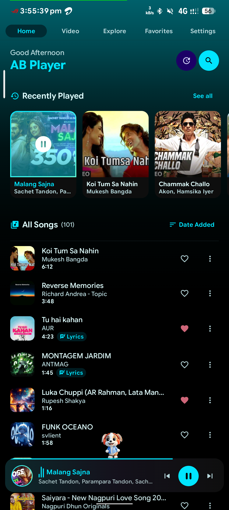
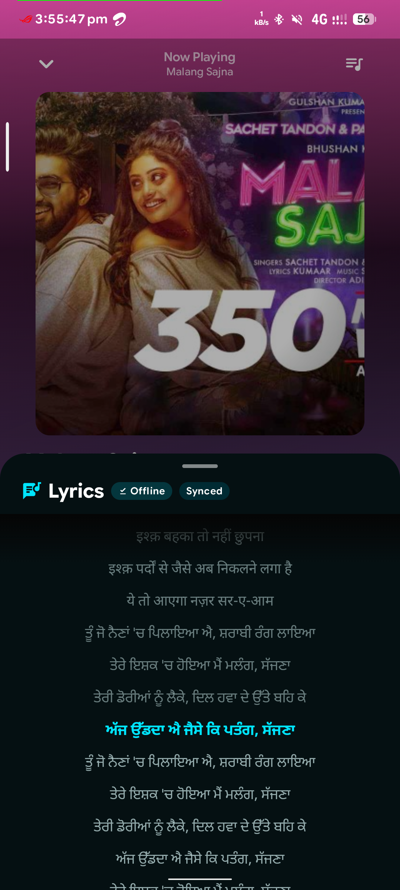
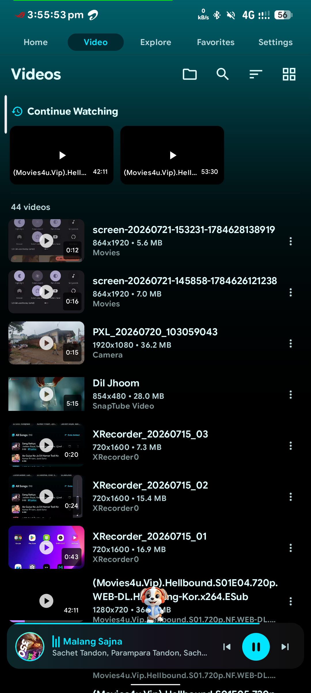

<div align="center">
  
  <h1>🎵 AB Player</h1>
  <p><strong>Your all-in-one offline music & video player for Android</strong></p>

  <p>
    
    
    
  </p>

  <a href="https://github.com/Sandeepbedia/AB-Player-v2/releases">
    
  </a>
</div>

<br>

<table align="center">
  <tr>
    <td width="33%" align="center">🎵 <b>Music</b><br><small>Albums, Artists, Playlists</small></td>
    <td width="33%" align="center">🎬 <b>Videos</b><br><small>PiP, Lock Screen, Gestures</small></td>
    <td width="33%" align="center">🎨 <b>Themes</b><br><small>7 Themes, 8 Accents</small></td>
  </tr>
</table>

---

## ✨ Features

<table>
  <tr>
    <td width="50%">
      <h3>🎵 Play Music</h3>
      <ul>
        <li>Browse by <b>Albums, Artists, Playlists, Folders</b></li>
        <li>Instant <b>Search</b></li>
        <li><b>Equalizer</b> with 11 presets</li>
        <li><b>Bass Boost</b>, <b>Crossfade</b>, <b>Skip Silence</b></li>
        <li><b>Sleep Timer</b>, <b>Queue</b>, Repeat Modes</li>
      </ul>
    </td>
    <td width="50%">
      <h3>🎬 Watch Videos</h3>
      <ul>
        <li>Grid & List views</li>
        <li><b>Picture-in-Picture (PiP)</b></li>
        <li>Swipe for <b>brightness & volume</b></li>
        <li><b>Lock screen</b> mode</li>
        <li><b>Orientation lock</b></li>
      </ul>
    </td>
  </tr>
  <tr>
    <td width="50%">
      <h3>🏠 Home</h3>
      <ul>
        <li><b>Recently Played</b> — resume instantly</li>
        <li>Sort: Name, Duration, Date, Size</li>
        <li><b>Multi-select</b> — share/delete bulk</li>
        <li>Quick <b>Shuffle All</b></li>
      </ul>
    </td>
    <td width="50%">
      <h3>🎨 Look & Feel</h3>
      <ul>
        <li><b>7 themes</b>: System, Light, Dark, AMOLED</li>
        <li><b>8 accent colors</b></li>
        <li><b>Dynamic Color</b> — matches wallpaper</li>
        <li>Neumorphism design</li>
      </ul>
    </td>
  </tr>
</table>

---

## 📸 Screenshots

<div align="center">

| Home | Now Playing |
|:----:|:-----------:|
|  |  |

| Lyrics | Video List |
|:------:|:----------:|
|  |  |

| Video Player | Explore |
|:------------:|:-------:|
|  |  |

| Favorites | Settings |
|:---------:|:--------:|
|  |  |

</div>

---

## 📥 Download

<div align="center">
  <a href="https://github.com/Sandeepbedia/AB-Player-v2/releases">
    
  </a>

  <br><br>
  <i>Or open <b>Settings > Check Updates</b> inside the app.</i>
</div>

---

## 🛠️ Build from Source

```bash
git clone https://github.com/Sandeepbedia/AB-Player-v2.git
cd AB-Player-v2
./gradlew installDebug
```

**Built with:** Kotlin · Jetpack Compose · Material 3 · ExoPlayer · Room DB · Hilt

---

## 🔄 Updates

- Automatic update checks on app launch
- One-tap download & install
- Full changelog history in Settings

---

## 👤 Connect

<div align="center">

[](https://github.com/Sandeepbedia)
[](https://github.com/Sandeepbedia/AB-Player-v2)

</div>

---

## 📄 License

MIT License — feel free to use, modify, and share.

---

<div align="center">
  <sub>Made with ❤️ by <a href="https://github.com/Sandeepbedia">Sandeepbedia</a></sub>
</div>
