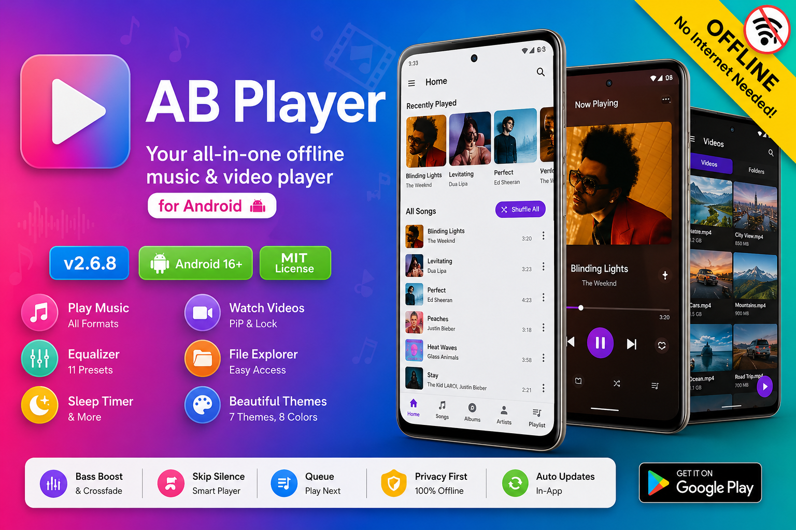

<div align="center">
  
  <h1>AB Player</h1>
  <p><strong>Your all-in-one offline music & video player for Android</strong></p>

  <p>
    
    
    
    
  </p>

  <a href="https://github.com/Sandeepbedia/AB-Player-v2/releases">
    
  </a>
</div>

<br>

<p align="center">
  <b>Music</b> · <b>Videos</b> · <b>Playlists</b> · <b>Equalizer</b> · <b>PiP</b> · <b>15+ Themes</b>
</p>

---

## Features

- **Music Playback** — Browse by albums, artists, playlists, folders. Queue management, repeat modes, sleep timer.
- **Video Player** — Picture-in-Picture (PiP) with Previous/Next controls, swipe gestures for brightness/volume, lock screen, orientation lock.
- **Equalizer** — 11 presets, bass boost, crossfade, skip silence, audio focus control.
- **Home Screen** — Recently played cards, sort by name/date/duration/size, multi-select for share/delete.
- **Search** — Instant search across your entire library.
- **Lyrics** — Synced (LRC) & plain text lyrics support with inline display in player.
- **Favorites** — Favorite songs with dedicated tab.
- **Playlists** — Create and manage custom playlists.
- **Explore** — Discover content by artist and album.
- **15+ Themes** — System, Light, Dark, AMOLED (10 variants including Midnight Navy, Violet, Turquoise, Neon Depth), Light pastel (Lavender, Mint, Coral, Sunrise, Ocean). Dynamic color support.
- **Custom Wallpaper** — Set any image as app background with blur/dim controls.
- **Home Widgets** — Compact 4x1 player widget with playback controls.
- **In-App Updates** — Automatic update check, one-tap download & install.
- **Crash Reporting** — Automatic crash log capture with one-tap share to developer.
- **Dog Pet** — Animated pet that sits on the mini player.

---

## Screenshots

<div align="center">

| Home | Now Playing |
|:----:|:-----------:|
|  |  |

| Lyrics | Video List |
|:------:|:----------:|
|  |  |

| Video Player | Explore |
|:------------:|:-------:|
|  |  |

| Favorites | Settings |
|:---------:|:--------:|
|  |  |

</div>

---

## Download

<div align="center">
  <a href="https://github.com/Sandeepbedia/AB-Player-v2/releases">
    
  </a>
  <br><br>
  <i>Or go to <b>Settings → Check Updates</b> inside the app.</i>
</div>

---

## Build from Source

```bash
git clone https://github.com/Sandeepbedia/AB-Player-v2.git
cd AB-Player-v2
./gradlew assembleDebug
```

**Prerequisites:**
- JDK 17
- Android SDK (compileSdk 36, minSdk 26)

**Tech Stack:**

| Layer | Technology |
|-------|-----------|
| Language | Kotlin 1.9.24 |
| UI | Jetpack Compose + Material 3 |
| DI | Hilt (Dagger) 2.51 |
| Database | Room 2.6.1 + KSP |
| Player | Media3 / ExoPlayer 1.3.1 |
| Images | Coil 2.6.0 (with video frame decoder) |
| Navigation | Navigation Compose 2.7.7 |
| Preferences | DataStore |
| Build | Gradle 8.5 + AGP 8.5 |

---

## Release Signing

For building a signed release APK/AAB, see [SIGNING.md](./SIGNING.md).  
Debug builds work out of the box — no signing setup needed.

---

## GitHub Actions

| Workflow | Status | Description |
|----------|--------|-------------|
| **Android Build** | [](https://github.com/Sandeepbedia/AB-Player-v2/actions/workflows/android-build.yml) | Builds debug APK on every push/PR |
| **Code Quality** | [](https://github.com/Sandeepbedia/AB-Player-v2/actions/workflows/quality-scan.yml) | Runs lint on every push/PR |

---

## Project Structure

```
AB-Player-v2/
├── .github/workflows/       # CI workflow files
├── app/
│   ├── src/main/
│   │   ├── kotlin/com/io/ab/music/
│   │   │   ├── data/
│   │   │   │   ├── db/          # Room database, DAOs, entities
│   │   │   │   ├── preferences/ # DataStore preferences
│   │   │   │   ├── repository/  # MusicRepository
│   │   │   │   └── scanner/     # Music & Video scanners
│   │   │   ├── di/              # Hilt modules
│   │   │   ├── domain/
│   │   │   │   └── model/       # Domain models
│   │   │   ├── service/         # MusicService (Media3 Session)
│   │   │   ├── ui/
│   │   │   │   ├── components/  # Reusable composables
│   │   │   │   ├── navigation/  # NavGraph, Screen routes
│   │   │   │   ├── screens/     # All screen composables
│   │   │   │   ├── theme/       # 15+ color schemes
│   │   │   │   └── viewmodel/   # ViewModels
│   │   │   ├── util/            # Crash handler, notifications
│   │   │   ├── utils/           # Extensions
│   │   │   └── widget/          # Home screen widgets
│   │   ├── res/                 # Resources
│   │   └── AndroidManifest.xml
│   └── build.gradle
├── gradle/
│   ├── libs.versions.toml      # Version catalog
│   └── wrapper/
├── screenshots/                # Screenshots for README
├── banner.png
├── settings.gradle
├── gradle.properties
└── gradlew
```

---

## Updates

- Automatic update check on app launch
- One-tap download & install from within the app
- Full changelog history available in Settings

---

## Contributing

Contributions welcome via Pull Requests! Please read [CONTRIBUTING.md](./CONTRIBUTING.md) before submitting one.

---

## Connect

<div align="center">

[](https://github.com/Sandeepbedia)
[](https://github.com/Sandeepbedia/AB-Player-v2)

</div>

---

## Credits & Thanks

- **[ExoPlayer](https://github.com/google/ExoPlayer) / Media3** — Powerful media playback engine by Google
- **[Coil](https://github.com/coil-kt/coil)** — Image loading for Android Compose
- **[Hilt](https://dagger.dev/hilt/)** — Dependency injection framework
- **[Room](https://developer.android.com/training/data-storage/room)** — Local database
- **[Material 3](https://m3.material.io/)** — Design system & components
- **[Jetpack Compose](https://developer.android.com/jetpack/compose)** — Modern Android UI toolkit
- **[Navigation Compose](https://developer.android.com/jetpack/compose/navigation)** — Type-safe navigation
- **[DataStore](https://developer.android.com/topic/libraries/architecture/datastore)** — Key-value storage
- **LRC Lyrics format** — Synced timed lyrics parsing & display in player
- All **open-source contributors** whose libraries make this project possible

---

## License

[MIT License](./LICENSE) — feel free to use, modify, and share.

---

<div align="center">
  <sub>Made with by <a href="https://github.com/Sandeepbedia">Sandeepbedia</a></sub>
</div>
